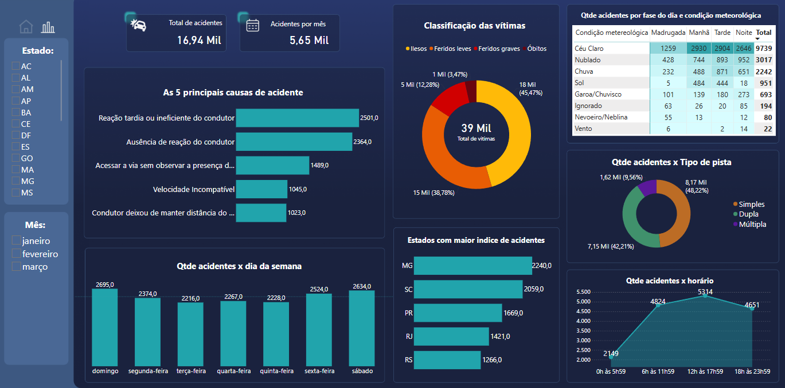

# 📊 Análise com Power BI
Este projeto contém um dashboard feito com Power BI para realizar uma análise dos acidentes de trânsito no primeiro trimestre de 2024 no Brasil, desenvolvido após o fim do _curso online gratuito de Power BI 2024 do Professor Ítalo Teotônio_ como uma atividade prática

## Base de dados
O projeto utiliza um conjunto de dados disponibilizados pela Policia Rodoviária Federal, denominado por [Documento CSV de Acidentes 2024 (Agrupados por ocorrência)](https://www.gov.br/prf/pt-br/acesso-a-informacao/dados-abertos/dados-abertos-da-prf)

## Visualizações
**1.** Capa para apresentação do projeto 
<div align="center">
  
</div>

<br>

**2.** Página de análise com insights <br>
<div align="center">
  
</div>

## Começando
### Pré-requisitos:
- Necessário fazer o [download](https://www.microsoft.com/pt-br/power-platform/products/power-bi/downloads) do Power BI Desktop

### Instalação
1. Clone esse repositório no seu terminal:
```
git clone https://github.com/leticiapinheirods/dashboard-powerbi.git
```
2. Abra o arquivo `dashboard - analise de acidentes de trânsito 1º tri 2024.pbix` no Power BI
